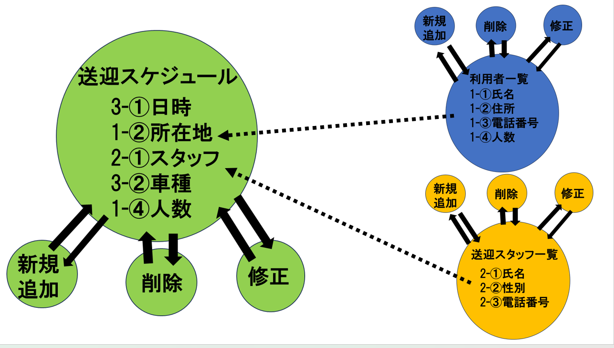
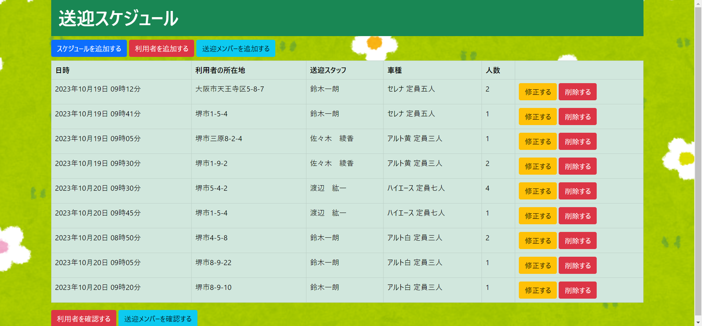
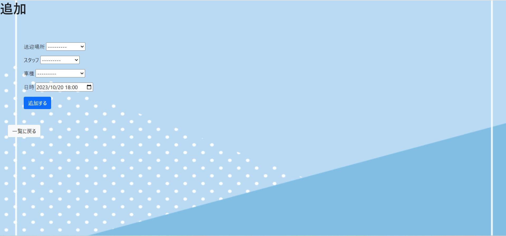
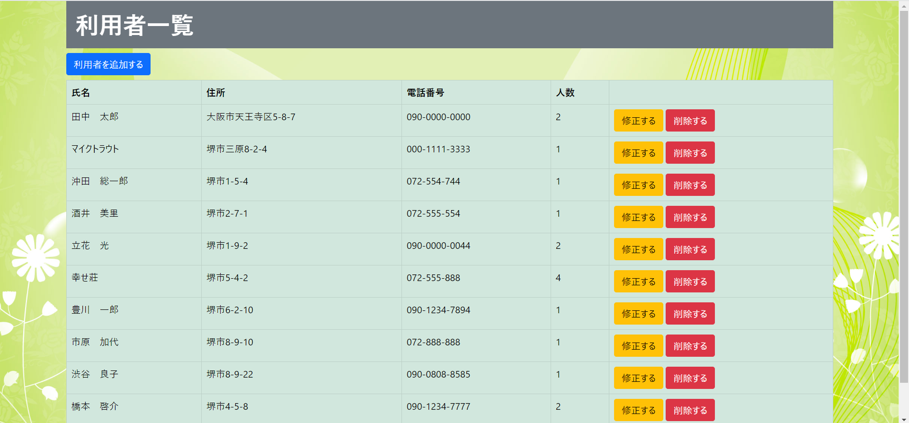
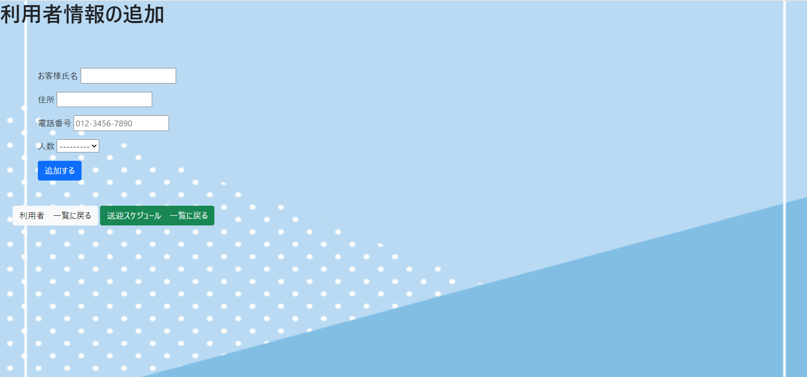
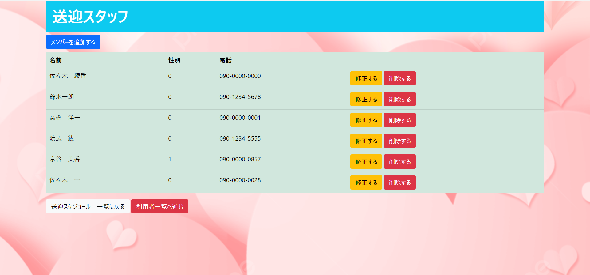
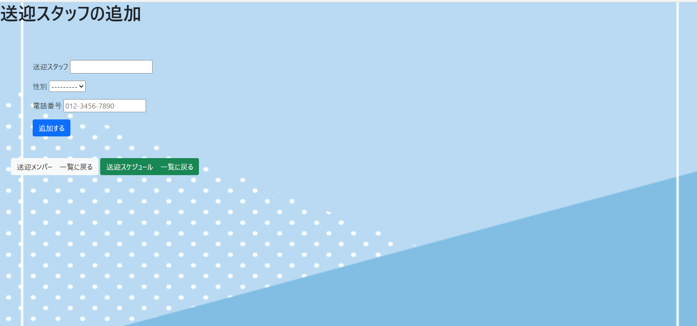

# pickupproject

### ●概要：Overview
介護の送迎を管理するアプリ
介護施設や事業所のスタッフが使用する、介護の送迎を管理するアプリです。

主な機能：
送迎の依頼の承認・送迎の状況確認・送迎の履歴管理

メリット：
送迎業務の効率化・送迎の利用状況の把握

### ●設計：conceptual design
●システムは、以下の2つの層で構成されています。

ユーザー層：ユーザーが操作する画面や機能を提供‥①

データ層：データの格納‥②

①ユーザー層は、ユーザーが操作する画面や機能を提供します。

具体的には、以下の画面や機能を提供します。

送迎の追加画面
・送迎の状況確認画面
・送迎の履歴管理画面

②データ層は、データを格納します。

具体的には、以下のデータを格納します。

送迎の追加情報・送迎の状況情報・送迎の履歴情報

●各層の役割や機能

各層の役割や機能は、以下のとおりです。

ユーザー層：ユーザーがアプリを操作するためのインターフェースを提供します。

データ層：送迎に関するデータを格納します。

●各層やモジュールの間の通信方法

各層やモジュールの間の通信方法は、以下のとおりです。

ユーザー層とデータ層：HTTPリクエストとレスポンスを使用して通信します。

### ●使い方：Usage
●使い方は、以下のとおりです。

アプリを起動し、ログインします。

送迎の追加画面から、送迎の依頼を入力します。

送迎の状況確認画面から、送迎の状況を確認します。

送迎の履歴管理画面から、送迎の履歴を管理します。

●各画面の使い方は、以下のとおりです。

送迎の追加画面

送迎の依頼者、送迎先、送迎日時、送迎内容などの情報を入力します。

送迎の状況確認画面

送迎の依頼状況、送迎の開始時間、送迎の終了時間などの情報を表示します。

そのほか依頼者(利用者)の追加や送迎スタッフの追加をも同様に可能です。

### ●環境：Requirement
プログラミング言語：Python HTML 
フレームワーク：Django
データベース：PostgreSQL
開発環境：Visual Studio Code
ビルドツール：Docker
その他　 Linax ubuntu 

### ●main menu

### ●create schedule

### ●update schedule

### ●delete schedule

### ●userlist menu

### ●create userlist

### ●update userlist

### ●delete userlist

### ●staff menu

### ●create staff

### ●update staff

### ●delete staff

